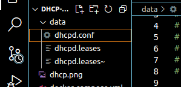
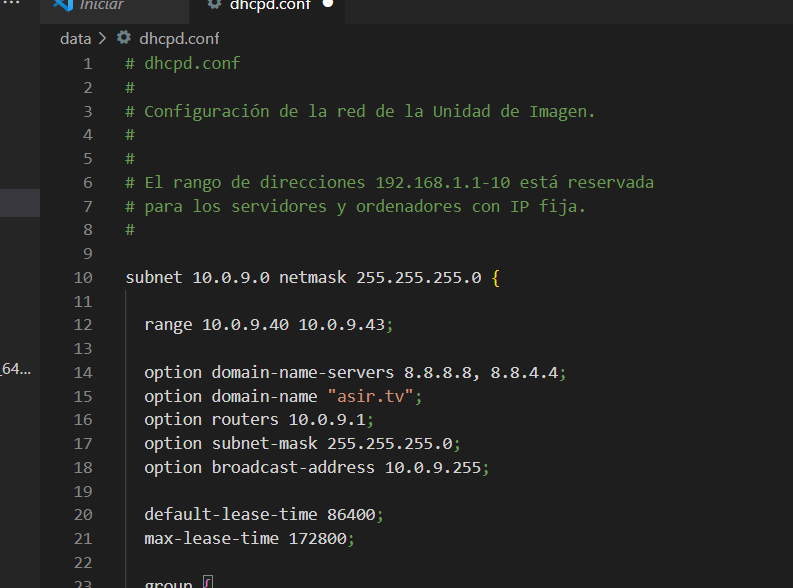
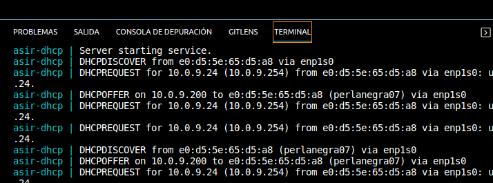
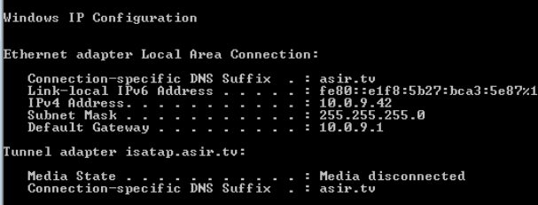

## Configurar un servidor de DHCP, en Docker.

Empezamos creando el fichero de docker-compose.yml y utilizar la red 'host'.

Como vemos, hace falta configurar muy poco de este archivo, dándole simplemente un nombre, imagen y mapear el volumen a la carpeta data.
Además hay que ponerle el network_mode para el host, que es el modo de red en el que un contenedor comparte su espacio de nombres de red con el host.

Debemos crear una carpeta data, que contendrá dentro el archivo de configuración de dhcpd.conf

Dentro de /data, creamos el archivo de configuración y modificamos la subnet conforme corresponde como vemos en la siguiente imagen:

Com el tipo de red está en host el contenedor tendrá la IP dk¡el equipo principal con el que estamos trabajando, que en este caso está en 10.0.9.1.

Para configurar l ainterfaz de escucha del tráfico de DHCP,solo hay que añadir el apartado "args: InterfaceName". Esto es para hacerlo directamente desde el docker-compose.
  args: enp1s0
  
También vemos en el archivo que le estamos dando un rango de IP al servidfor DHCP para que asigne dentro de ese rango.
  subnet 10.0.9.0 netmask 255.255.255.0 {    
    range 10.0.9.40 10.0.9.43;
    
Por último y para que todo funcione correctamente debemos configurar en el archivo el apartado del group que define los parámetros del lease y los que están dentro del host (con la dorección MAC y la IP que se van a asignar.)
  group {
   default-lease-time 500000;
    max-lease-time 10000000;

    host asir_client {
        hardware ethernet 08:00:27:6F:AD:EF;
        fixed-address 10.0.9.42;
    } 
  }

Una vez configurados todos los archivos pertinentes simplemente levantamos el contedor, docker-compose up y vemos que funciona correctamente el DHCP:

Vemos que nos conectamos a la máquina virtual y vemos la Ip de dicha máquina:

