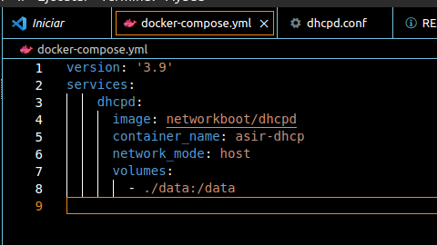

## Configurar un servidor de DHCP, en Docker.

Empezamos creando el fichero de docker-compose.yml y utilizar la red 'host'.

Como vemos, hace falta configurar muy poco de este archivo, dándole simplemente un nombre, imagen y mapear el volumen a la carpeta data.
Además hay que ponerle el network_mode para el host, que es el modo de red en el que un contenedor comparte su espacio de nombres de red con el host.

Debemos crear una carpeta data, que contendrá dentro el archivo de configuración de dhcpd.conf

Dentro de /data, creamos el archivo de configuración y modificamos la subnet conforme corresponde como vemos en la siguiente imagen:

Una vez configurados todos los archivos pertinentes simplemente levantamos el contedor, docker-compose up y vemos que funciona correctamente:

